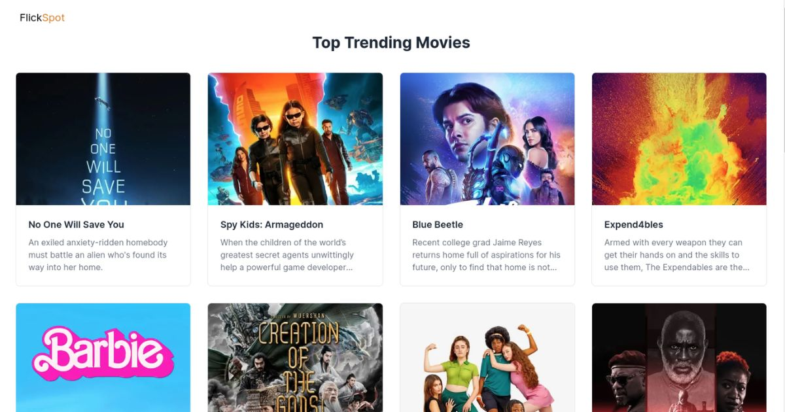

# FlickSpot

**Note:** This is a test project to experiment with Next.js 13's new server actions which are still experimental. It should not be used in a production environment.

FlickSpot is a web application designed to display the latest movies and allow users to share their comments and thoughts about them. It leverages the free movie API from [TMDB](https://www.themoviedb.org) to fetch movie data and utilizes Prisma with a serverless MySQL database from Planetscale to store and retrieve user comments.



## Table of Contents
- [Prerequisites](#prerequisites)
- [Setup and Deployment](#setup-and-deployment)
- [Usage](#usage)
- [Contributing](#contributing)
- [Resources](#resources)
- [License](#license)
- [Support](#support)

## Prerequisites
Before you begin, make sure you have the following prerequisites:

- [Node.js](https://nodejs.org/) installed (version 14.x or later).
  This project was built using Node.js v20.5.1. If you use NVM, you can run `nvm use` to switch to this version.
- An account with [Planetscale](https://planetscale.com). You can use their free Hobby plan.
- An account with [TMBD](https://www.themoviedb.org). Apply for free access to their API (will most likely be granted immediately).


## Setup and Deployment
1. Clone this repository:
   ```bash
   git clone https://github.com/your-username/flickspot.git
   ```
2. Move into the project directory:
    ```bash
    cd flickspot
    ```
3. Install the required packages:
    ``` bash
    npm ci 
    ```
4. Set up your environment variables by creating a .env file with the following content:
    ``` env
    MOVIE_DB_API=<your_TMBD_api_key>
    DATABASE_URL='<your_database_url>'
    ```
   You can also simply rename the `.env.example` file that comes with this project.
   Replace your_TMDV_api_key with your API key from themoviedb.org and your_database_url with the URL for your Planetscale/Prisma database.

5. Run the development server:
    ```bash
    npm run dev
    ```
6. Access the application in your web browser at http://localhost:3000.


## Usage
- Browse the latest movies.
- Leave comments and thoughts on movies.
- Enjoy exploring and interacting with FlickSpot!

## Contributing
Contributions are welcome! If you'd like to contribute to this project or have suggestions, please open an issue or submit a pull request. Please follow the [Code of Conduct](./CODE_OF_CONDUCT.md) when contributing.

To submit a pull request:

1. [Fork](https://docs.github.com/en/get-started/quickstart/fork-a-repo) the repository.
2. Create your feature branch: `git checkout -b feature/<your-feature-name>`
3. Commit your changes: `git commit -am '<Add some feature>'`
4. Push to the branch: `git push origin feature/<your-feature-name>`
5. Create a new Pull Request.

## Resources
- TMDB: https://themoviedb.org
- PlanetScale: https://planetscale.com
- Prisma: https://www.prisma.io/
- Node.js: https://nodejs.org/
- Next.js: https://nextjs.org
- Next.js Server Actions: https://nextjs.org/docs/app/api-reference/functions/server-actions

## License
This project is open-source and available under the [MIT License](./LICENSE.md).

## Support
If you have any questions or need assistance, feel free to open an issue in the repository or reach out to me via email at: hello@tanjaschmidt.com.


